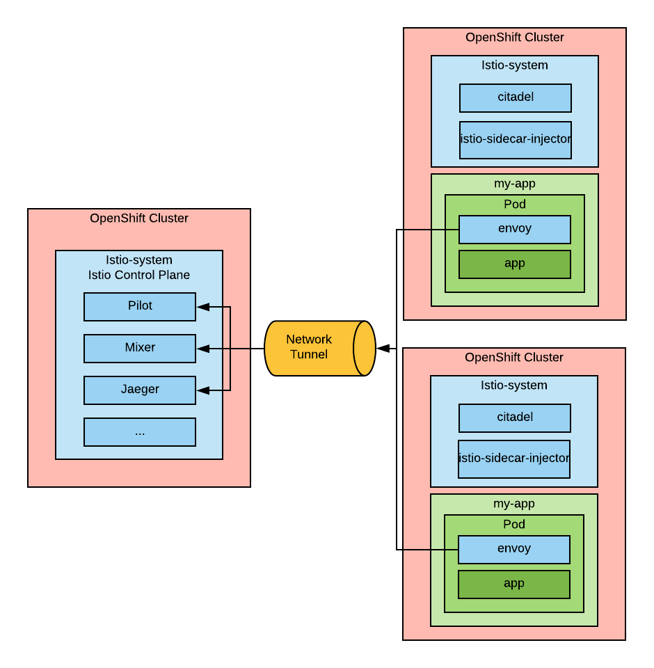

# Istio-Multicluster for OpenShift

This repo features an ansible playbook that installs istio-multicluster on a set of OpenShift clusters.

The following prerequisites have to be met:

1. The Pod's IPs must be routable between each other across all the cluster. To meet this requirement you can build an SDN network tunnel as described [here](https://blog.openshift.com/connecting-multiple-openshift-sdns-with-a-network-tunnel/)
2. The istio control plane must be installed in one of the cluster. To do so, you can follow the instruction on installing [Red Had OpenShift Service Mesh](https://docs.openshift.com/container-platform/3.11/servicemesh-install/servicemesh-install.html). If you want to run a quick trial, you can rune these commands:
```
oc new-project istio-operator
oc new-app -f artifacts/istio_product_operator_template.yaml --param=OPENSHIFT_ISTIO_MASTER_PUBLIC_URL=<master public url> -n istio-operator
oc apply -f artifacts/openshift-servicemesh[-mTLS].yaml -n istio-operator
```
use the `-mTLS` version of the servicemesh definition file, if you want to enable mTLS

3. If you want to enable mTLS between services, istio must be installed with an external ca. If you have installed istio with the above link, you can just run the following:
```
oc create secret generic cacerts -n istio-system --from-file=artifacts/certs/ca-cert.pem \
    --from-file=artifacts/certs/ca-key.pem --from-file=artifacts/certs/root-cert.pem \
    --from-file=artifacts/certs/cert-chain.pem
oc patch deployment/istio-citadel -n istio-system -p '{"spec": { "template": {"spec": { "containers": [{"args": ["--append-dns-names=true","--grpc-port=8060","--grpc-hostname=citadel","--citadel-storage-namespace=istio-system","--custom-dns-names=istio-pilot-service-account.istio-system:istio-pilot.istio-system,istio-ingressgateway-service-account.istio-system:istio-ingressgateway.istio-system","--self-signed-ca=false","--signing-cert=/etc/cacerts/ca-cert.pem","--signing-key=/etc/cacerts/ca-key.pem","--root-cert=/etc/cacerts/root-cert.pem","--cert-chain=/etc/cacerts/cert-chain.pem"],"name": "citadel","volumeMounts": [{"name":"cacerts","mountPath":"/etc/cacerts","readOnly":true}]}],"volumes":[{"name":"cacerts","secret":{"secretName":"cacerts","optional":true}}]}}}}'
oc delete secret istio.default -n istio-system
```
If for the above step, you didn't use the provided example ca certificates, make sure to ovveride the certificate location with the ansible var: `certificate_dir`

Once you met the above requirements you can run the playbook to install istio-multicluster.

If you have used the link suggested above to install the network tunnel across the OpenShift SDNs, you can reuse the same inventory to run the istio-multiclutser playbook.

Istio multicluster has the following architecture:



## Installing Istio-multicluster

See an example of the inventory [here](./ansible/inventory) and customize it for your clusters.

Here is a minimum inventory:
```
clusters:
- name: <cluster_1_name>
  url: <cluster_1_master_api_url>
  username: <cluster_1_username>
  password: <cluster_1_password>
  istio_control_plane: true  
- name: <cluster_2_name>
  url: <cluster2_master_api_url>
  username: <cluster_2_username>
  password: <cluster_2_password>
  istio_control_plane: false 
```
You must have exaclty one cluster with the `istio_control_plane` variable set to `true`.

You can choose the istio version that you want to install by setting the following variable: `istio_git_tag`.

You can run the playbook as follows:

```
ansible-playbook -i <inventory> ./ansible/playbooks/deploy-istio-multicluster/deploy-istio-multicluster.yaml
```


## Deploying the bookinfo app

This example show how to deploy the bookinfo app and secure all the internal connections with mTLS and the inbound traffic with 1-way TLS.
So you need to have set the `enable_mTLS` option to true (the default).
The generated deployment is the following:


You can reuse the same inventory you used to deploy istio-multicluster, but you need to add the following variable `bookinfo_domain`.
this variable will define the domain on which bookinfo will be exposed. the only hostname accepted by the ingress-gateway is going to be bookinfo.<bookinfo_domain>. You can run the inventory as follows:

```
ansible-playbook -i <inventory> ./examples/bookinfo/ansible/playbooks/deploy-bookinfo/deploy-bookinfo.yaml
```

The ingress gateway is exposed with a LoadBalance service. This will create an extenral IP in cloud environments. In non cloud environments you can use featyures like [externalIPs](https://docs.openshift.com/container-platform/3.11/admin_guide/tcp_ingress_external_ports.html) or node ports. Because the application is deployed on multiple clusters, you will have multiple external IP. the booninfo fully qualified name should be resolved to any of those IP. It is up to you to configure a (global) load balancer to do so.